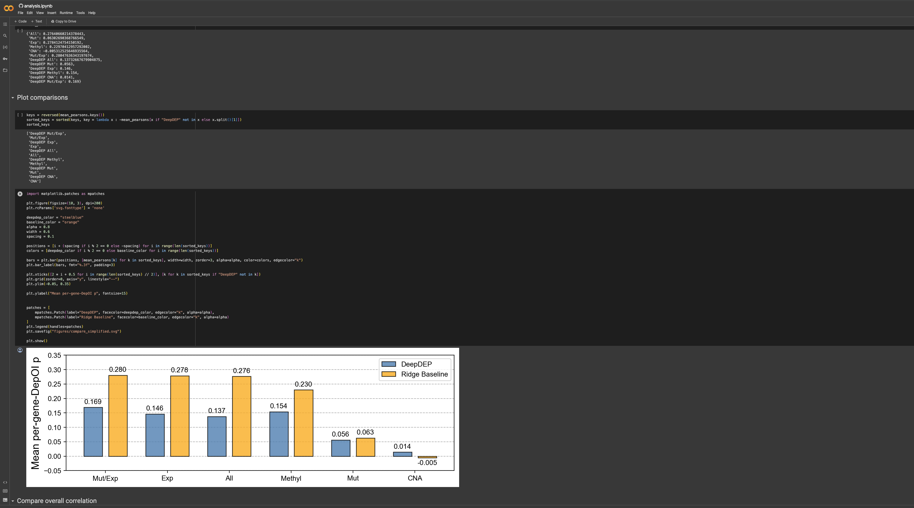

# DeepDEP Reanalysis

Code for: 

[Ridge regression baseline model outperforms deep learning method for cancer genetic dependency prediction](https://www.biorxiv.org/content/10.1101/2023.11.29.569083). Daniel Chang, Xiang Zhang, Chad Myers. *bioRxiv* (2023)

Please use the colab notebook linked above to reproduce the re-analysis.
